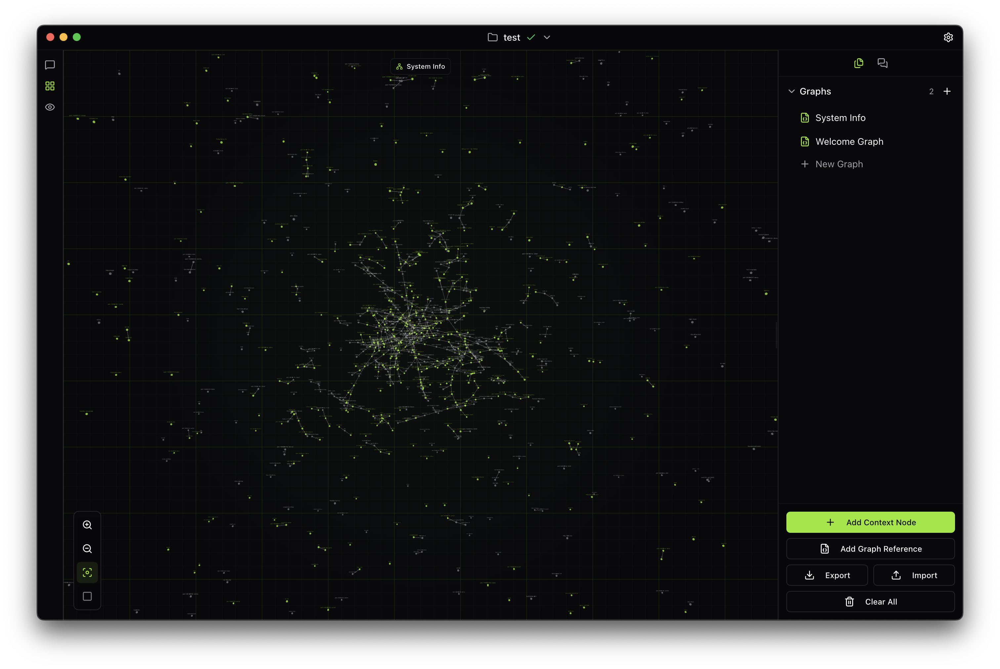

<div align="center">
  
  
  # nografo
  
  **Version 0.0.1**
  
  A graph-based context engine that leverages language models to provide intelligent and relevant answers based on structured data.
</div>


<div align="center">
  
</div>

---

## About

Nografo is formulated based on the latest research, particularly: [https://zenodo.org/records/17330235](https://zenodo.org/records/17330235)

## Installation

### Prerequisites

- **Node.js** >= 18.0.0
- **npm** or **yarn**

### Steps

1. **Clone the repository**
   ```bash
   git clone https://github.com/patrick-mns/nografo.git
   cd nografo
   ```

2. **Install dependencies**
   ```bash
   npm install
   ```

3. **Install API dependencies**
   ```bash
   cd api
   npm install
   cd ..
   ```

## Usage

### Development Mode

#### Run the full application (Frontend + API + Electron)
```bash
npm run electron:dev
```

This command will start:
- Vite development server (port 3000)
- API server (port 3001)
- Electron application

#### Run only the web interface
```bash
npm run dev
```

#### Run only the API server
```bash
npm run dev:api
```

#### Run both web and API (without Electron)
```bash
npm run dev:full
```

### Production Build

#### Build for Electron (Desktop Application)

**macOS:**
```bash
npm run electron:build:mac
```

**Quick build (current platform only):**
```bash
npm run electron:build:quick
```

**Build for all platforms:**
```bash
npm run electron:build
```

The built application will be available in the `release` directory.

> **Note:** When testing the preview build on macOS, you may need to remove the quarantine attribute after installing the app:
> ```bash
> sudo xattr -d com.apple.quarantine /Applications/Nografo.app
> ```

### Code Quality

#### Check code formatting and linting
```bash
npm run check
```

#### Auto-fix formatting and linting issues
```bash
npm run fix
```

#### Type checking
```bash
npm run type-check
```

## License

This software is dual-licensed under the GNU Affero General Public License v3.0 (AGPLv3) for open source use, and a commercial license for proprietary applications.

- [View AGPLv3 License](https://www.gnu.org/licenses/agpl-3.0.html)
- [Contact for Commercial License](https://github.com/patrick-mns)
